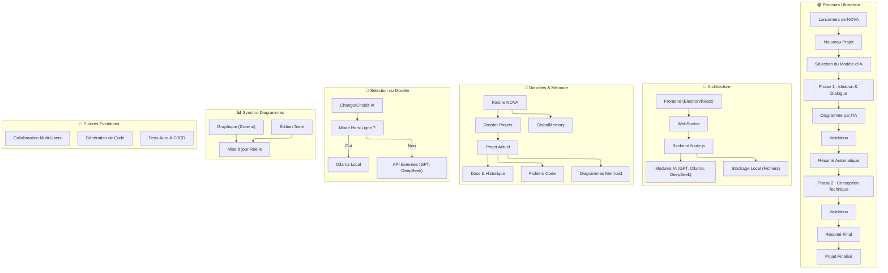

Voici une version **plus synthétique** et structurée pour faciliter **l’assimilation** par l’IA (et par tout lecteur). Les sections sont courtes, les formulations concises, et le diagramme Mermaid reste présent mais allégé dans ses annotations.

---

# NOVA – OVERVIEW

> **Version :** v0.4  
> **Auteur :** Équipe NOVA & IA intégrée

## 1. Présentation

- **NOVA** est une plateforme d’**assistance au développement** logiciel par l’IA.
- Elle accompagne l’utilisateur **de l’idée de départ** jusqu’au **déploiement**, en s’appuyant sur :
  - **Chat IA** multi-modèles (ChatGPT-4, Ollama, DeepSeek…),
  - **Éditeur de diagrammes Mermaid** (synchro en temps réel),
  - **Mémoire contextuelle** (historique, tâches, résumés),
  - **Scripts d’automatisation** (tests, intégration, etc.).

**Problèmes passés** (v0.1, v0.2, v0.3) :

- Mauvaise intégration (Vue/Electron/Webpack), fichiers trop gros, tests inopérants, duplication de code, etc.
- **v0.4** vise une architecture plus claire, une documentation centralisée et un usage de protocoles (createFile, editFile, etc.) pour guider l’IA.

---

## 2. Objectifs

1. **Maintien du contexte** : L’IA retient les discussions, les tâches, l’architecture du projet.
2. **Diagramme évolutif** : Visualiser l’état d’avancement (modules, liens, fonctionnalités) en temps réel.
3. **Multi-Projets** : Chaque projet est isolé, avec son historique et ses fichiers.
4. **Évolutivité** : Prévoyance pour la génération de code, tests automatisés et mode collaboratif.

---

## 3. Diagramme Global

---

## 4. Fonctionnalités Clés

1. **Chat IA** : Dialogue assisté, questions sur la conception, la gestion de projet, etc.
2. **Éditeur Mermaid** : Génération et mise à jour automatique de diagrammes.
3. **Système de mémoire** : Historique de discussion, fichiers, tâches ; permet de retrouver le fil du projet.
4. **Module Summary** : Résumé automatique toutes les X interactions.
5. **Mode Hors-Ligne** : Utiliser un modèle local (Ollama) au lieu d’appels API externes.

---

## 5. Avantages et Bonnes Pratiques

- **Arborescence claire** : Séparer backend, frontend, docs, scripts, tests, etc.
- **Limite ~400 lignes/fichier** : Pour éviter les fichiers “monstres”.
- **Protocoles d’action** : (createFile, editFile, runTests…) pour guider l’IA et limiter les confusions.
- **Gestion multi-projets** : Un dossier par projet (ex. `Projects/MonProjet`) pour stocker code, diagrammes, docs.
- **Tests réguliers** : Vérifier le bon fonctionnement à chaque étape (npm test, scripts/run-tests.js…).

---

## 6. Conclusion

- **NOVA v0.4** unifie les enseignements des versions passées, permettant une **plateforme solide** pour la création de projets via l’IA.
- L’utilisateur est accompagné **pas à pas** (idéation → conception → résumé → finalisation).
- Le système reste **ouvert** à des évolutions futures (tests automatiques, génération de code, CI/CD, etc.).

**Fin du document**

_(Ce document peut être nommé `NOVA_OVERVIEW.md` et placé dans `docs/`.)_
